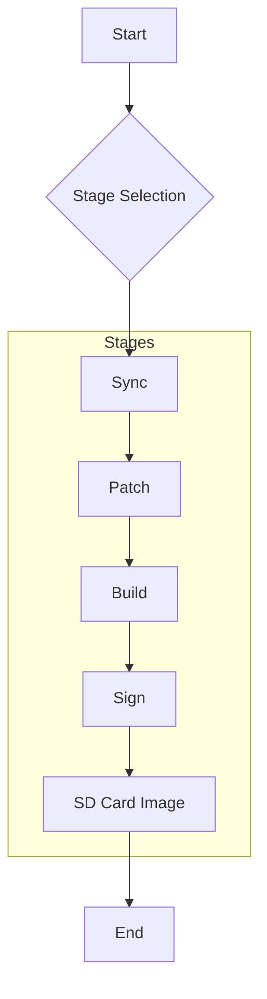
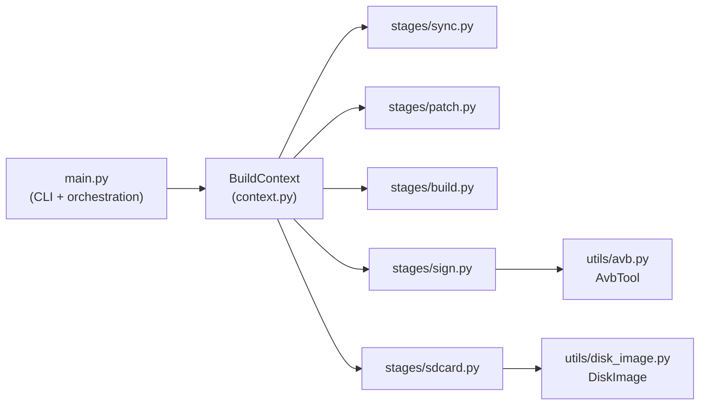
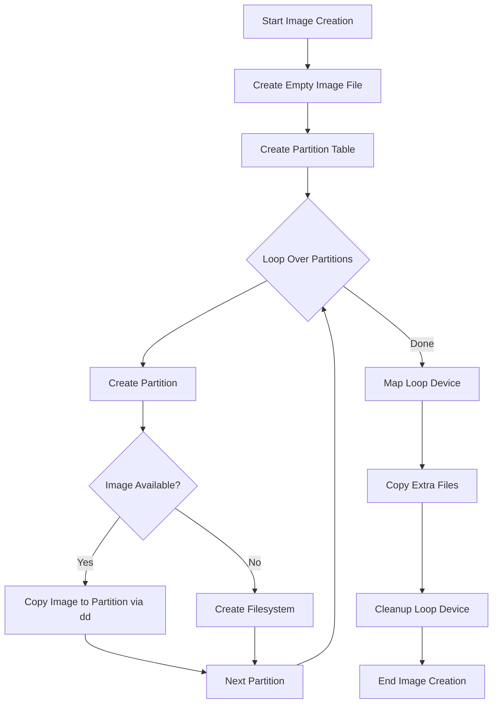

# Architecture Documentation

## Introduction

This document describes the architecture of the `meta-rpi5-secure-aosp` project. This project provides a tool called `rpi5-build` to build a secure AOSP (Android Open Source Project) image for the Raspberry Pi 5. The tool is designed to be flexible and allows users to select which parts of the image to build and which stages to run.

## Project Goals

The overarching goal of the project is to replicate the commercial boot-up workflow and learn the essentials of a secure boot-up process. 

Currently, the project implements the following boot chain:
`RPi5 Bootloader -> U-Boot -> Kernel -> AOSP`

### High-Level Future Goals
1. **A/B Partition Scheme**: Implement an A/B partition scheme for all partitions apart from the boot partition to support seamless updates.
2. **OP-TEE Integration**: Include OP-TEE (Open Portable Trusted Execution Environment) in the boot chain for advanced security features and trusted applications.
3. **AOSP Security Features**: Enable and enforce AOSP security features.
4. **Hardware & Boot-Level Security**: Integrate ARM Trusted Firmware-A (TF-A) (EL3), implement Anti-Rollback Protection, and explore Raspberry Pi's Hardware Root of Trust (OTP/eFuses).
5. **Kernel-Level Security & Hardening**: Implement KASLR, Control Flow Integrity (CFI), and the Linux Lockdown LSM to protect kernel memory and execution flow.
6. **File System & Storage Security**: Configure Android's `vold` for File-Based Encryption (FBE) backed by a Hardware Keystore.
7. **AOSP System & HAL Security**: Develop Keymaster/KeyMint and Gatekeeper HALs that communicate securely with Trusted Applications (TAs) in OP-TEE.
8. **User-Process Level Security**: Enforce strict SELinux policies (Enforcing Mode) and sandbox custom native services using Seccomp-BPF.

## Motivation

The main motivation for this project is to provide a simple and automated way to build a secure AOSP image for the Raspberry Pi 5. Building AOSP for a new device can be a complex and time-consuming process. This project aims to simplify this process by providing a single tool that automates all the necessary steps, from syncing the source code to generating the final SD card image. The "secure" aspect comes from the integration of Android Verified Boot (AVB), which ensures the integrity of the software on the device.

## Design

The project is designed as a command-line tool that orchestrates a series of stages to produce a final SD card image. The design is modular, allowing for future extensions and modifications.

### High-Level Design (HLD)

The `rpi5-build` tool operates in several distinct stages. The user can choose to run all stages sequentially or run a specific stage. The following diagram illustrates the high-level workflow:



- **Sync:** Synchronises the source code for U-Boot and AOSP from their respective repositories.
- **Patch:** Applies git patch files (`.patch`) to the U-Boot and/or AOSP source trees. Patches are stored under `patches/uboot/` and `patches/aosp/<project>/` and applied with `git am --3way`.
- **Build:** Compiles the U-Boot and AOSP source code to produce boot, system, and vendor images.
- **Sign:** Signs the generated images using Android Verified Boot (AVB) to ensure their integrity.
- **SD Card Image:** Generates a bootable SD card image containing all the necessary partitions and images.

### Low-Level Design (LLD)

#### Package Structure

```text
src/meta_rpi5_secure_aosp/
├── main.py          # CLI entry point and pipeline orchestration
├── context.py       # BuildContext dataclass — shared state for all stages
├── stages/          # One module per pipeline stage
│   ├── __init__.py
│   ├── sync.py      # Stage: clone / repo-sync source trees
│   ├── patch.py     # Stage: apply git patches to uboot and/or aosp
│   ├── build.py     # Stage: compile uboot and/or aosp
│   ├── sign.py      # Stage: AVB-sign partition images
│   └── sdcard.py    # Stage: assemble the SD-card image
└── utils/           # Reusable utilities with no pipeline knowledge
    ├── __init__.py
    ├── avb.py        # AvbTool — wraps avbtool commands
    └── disk_image.py # DiskImage — low-level disk image construction
```

#### Module Responsibilities

- **`main.py`**: Defines the `click` CLI, resolves which stages and code targets are active, resolves build/security mode options (`build_variant`, signing, SELinux mode, AVB fail policy, boot-state override, cmdline profile, `encryption_mode`), constructs a `BuildContext`, and calls each stage module in order:
  ```
  sync → patch → build → sign → sdcard
  ```

- **`context.py`**: Defines the `BuildContext` dataclass that carries all shared state (workspace paths, flags, the shell-runner callable, the Rich console) and is passed to every stage `run()` function.

- **`stages/sync.py`**: Clones or updates the U-Boot git repository and initialises / syncs the AOSP repo manifest.

- **`stages/patch.py`**: Discovers `.patch` files under `patches/uboot/` and `patches/aosp/<project>/`, dry-runs each with `git apply --check`, then applies them with `git am --3way`.

- **`stages/build.py`**: Cross-compiles U-Boot for `rpi_arm64_defconfig`, renders boot script templates with resolved mode options, and builds the AOSP `aosp_rpi5_car-bp4a-<variant>` lunch target.

- **`stages/sign.py`**: Uses `AvbTool` to add AVB hash footers to each partition image, append vbmeta sidecars, and produce a combined `vbmeta.img`.

- **`stages/sdcard.py`**: Resolves signed vs. unsigned image paths and delegates to `DiskImage` to assemble the final SD card image.

- **`utils/avb.py`** (`AvbTool`): Wraps `avbtool` invocations (`add_hash_footer`, `append_vbmeta_image`, `make_vbmeta_image`). Locates the binary from the AOSP build output or `$PATH`.

- **`utils/disk_image.py`** (`DiskImage`): Handles all low-level disk image mechanics — allocating the image file, partitioning with `parted`, loop-mounting with `losetup`/`kpartx`, copying images with `dd`, creating filesystems, copying extra files, and cleanup.

#### Stage Interaction Diagram



#### SD Card Image Creation



#### Patch Directory Layout

```text
patches/
├── uboot/                        # Patches applied to u-boot/
│   ├── 0001-some-fix.patch
│   └── 0002-another-fix.patch
└── aosp/                         # Patches applied to rpi5-aosp/
    ├── device_brcm_rpi5/         # Subdirectory name = project path in rpi5-aosp/
    │   └── 0001-car-config.patch
    └── kernel_rpi/
        └── 0001-driver-fix.patch
```

Patches within each directory are applied in alphabetical order using `git am --3way`.

### Container & Workspace Architecture

#### File Structure

```text
.
├── scripts/
│   ├── docker_run.sh         # Main Docker wrapper script & entrypoint
│   ├── run_src.sh            # Container entrypoint for Python builder
│   └── flash_sdcard.sh       # Helper to flash the generated image to an SD card
├── patches/                  # Git patch files for uboot and aosp
│   ├── aosp/
│   └── uboot/
├── src/
│   └── meta_rpi5_secure_aosp/
│       ├── main.py           # CLI entry point
│       ├── context.py        # BuildContext dataclass
│       ├── stages/           # Pipeline stage modules
│       └── utils/            # Reusable utility modules
└── work/                     # Workspace (mounted in container)
    ├── .venv/                # Python virtual environment
    ├── .cache/               # Build caches
    ├── u-boot/               # U-Boot source
    ├── rpi5-aosp/            # AOSP source
    └── sdcard/               # Generated images
```

#### How It Works

1. **`scripts/docker_run.sh`**:
   - Computes the SHA256 hash of the Dockerfile.
   - Checks if an image with `rpi5-<sha256>` exists. If not, it builds it.
   - Cleans up any existing containers running for the workspace.
   - Creates a new container with proper mounts and privileges.
   - Sets up Python virtual environment if it doesn't already exist.
   - Executes the Python app through `scripts/run_src.sh` or starts an interactive shell.
   - Automatically cleans up on exit.

2. **`scripts/run_src.sh`**:
   - Sets up environment variables.
   - Activates Python virtual environment.
   - Executes the Python builder with arguments.

3. **`scripts/flash_sdcard.sh`**:
   - Helper script to flash the generated SD card image to a physical SD card device.

### Encryption Model

The builder supports three encryption modes configured via `encryption.mode` in the rpi5 config YAML (or `--encryption-mode` CLI override):

| Mode | Description | Prerequisites |
|------|-------------|---------------|
| `disabled` | No encryption (default) | None |
| `fde` | Full-disk encryption via dm-crypt | Signing enabled, `fail_closed`, `userdata`+`metadata` partitions |
| `fbe` | File-based encryption via fscrypt | Same as FDE |

**FBE activation chain:**

```
config encryption.mode=fbe
  → pipeline passes RPI5_ENABLE_FBE=true to AOSP make
    → device.mk selects fstab.rpi5.fbe
      → fstab.rpi5.fbe has fileencryption= + keydirectory= on userdata
        → vold reads fstab at first-stage mount
          → sets up dm-default-key over userdata (metadata encryption)
            → applies fscrypt policy on /data (per-file encryption)
              → ro.crypto.type=file, ro.crypto.state=encrypted
```

The `__ENCRYPTION_ARGS__` placeholder in `config/uboot/boot_avb.cmd` is rendered by `stages/build.py` with the resolved encryption cmdline arg (e.g. `androidboot.encryption_mode=fbe`), which is passed through U-Boot `bootargs` to the kernel.

FBE depends on AVB: `fstab.rpi5.fbe` inherits `avb=vbmeta` on system/vendor from `fstab.rpi5.avb`. The prebuilt RPi5 AOSP kernel (`device/brcm/rpi5-kernel/Image`) has `CONFIG_FS_ENCRYPTION=y` compiled in unconditionally — no kernel source patch is required.
