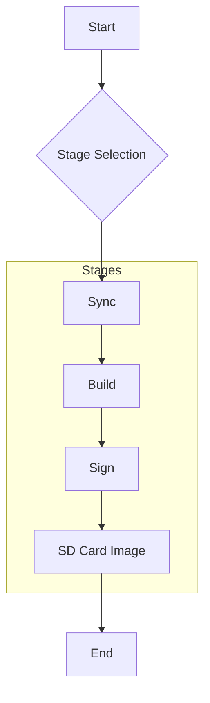
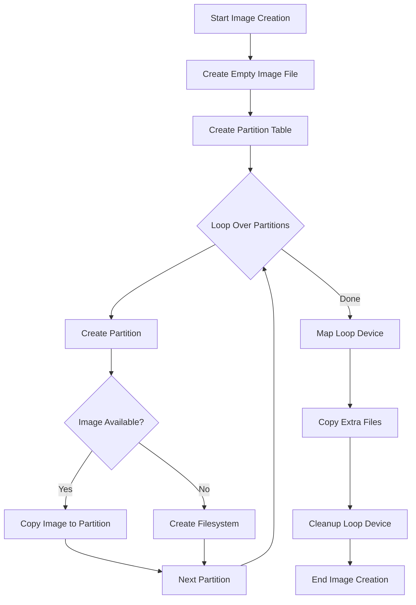

# Architecture Documentation

## Introduction

This document describes the architecture of the `meta-rpi5-secure-aosp` project. This project provides a tool called `rpi5-build` to build a secure AOSP (Android Open Source Project) image for the Raspberry Pi 5. The tool is designed to be flexible and allows users to select which parts of the image to build and which stages to run.

## Motivation

The main motivation for this project is to provide a simple and automated way to build a secure AOSP image for the Raspberry Pi 5. Building AOSP for a new device can be a complex and time-consuming process. This project aims to simplify this process by providing a single tool that automates all the necessary steps, from syncing the source code to generating the final SD card image. The "secure" aspect comes from the integration of Android Verified Boot (AVB), which ensures the integrity of the software on the device.

## Design

The project is designed as a command-line tool that orchestrates a series of stages to produce a final SD card image. The design is modular, allowing for future extensions and modifications.

### High-Level Design (HLD)

The `rpi5-build` tool operates in several distinct stages. The user can choose to run all stages sequentially or run a specific stage. The following diagram illustrates the high-level workflow:

- **Sync:** This stage synchronizes the source code for U-Boot and AOSP from their respective repositories.
- **Build:** This stage compiles the U-Boot and AOSP source code to produce boot, system, and vendor images.
- **Sign:** This stage signs the generated images using Android Verified Boot (AVB) to ensure their integrity.
- **SD Card Image:** This stage generates a bootable SD card image containing all the necessary partitions and images.

### Low-Level Design (LLD)

The project consists of two main Python files: `main.py` and `image_builder.py`.

- **`main.py`**: This file contains the main entry point for the `rpi5-build` command-line tool. It uses the `click` library to define the command-line interface and its options. It is responsible for parsing the user's input, determining which stages and code to process, and then executing the corresponding logic.

- **`image_builder.py`**: This file contains the `ImageBuilder` class, which is responsible for creating the final SD card image. It encapsulates all the logic for creating partitions, copying image files, and handling the low-level details of image creation.

The image creation process is as follows:

This modular design separates the high-level build orchestration from the low-level image creation details, making the code easier to understand, maintain, and extend.
